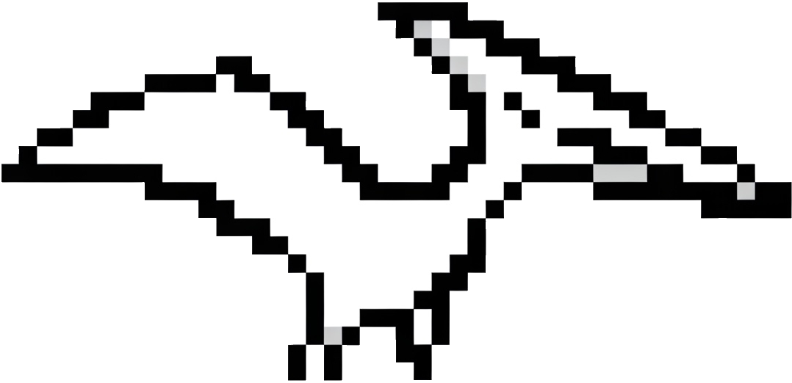
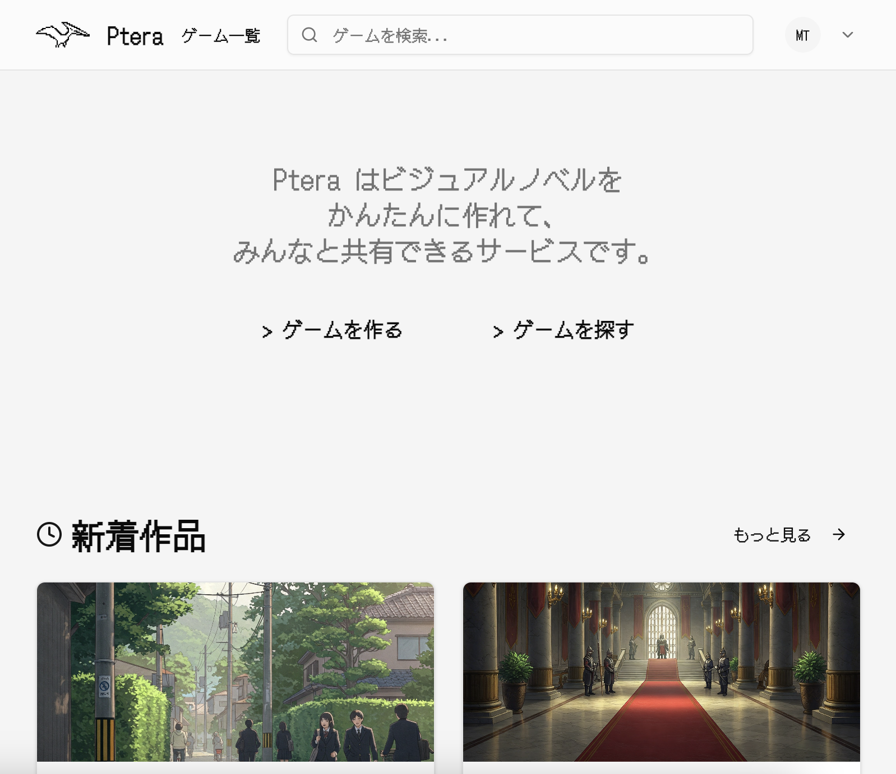
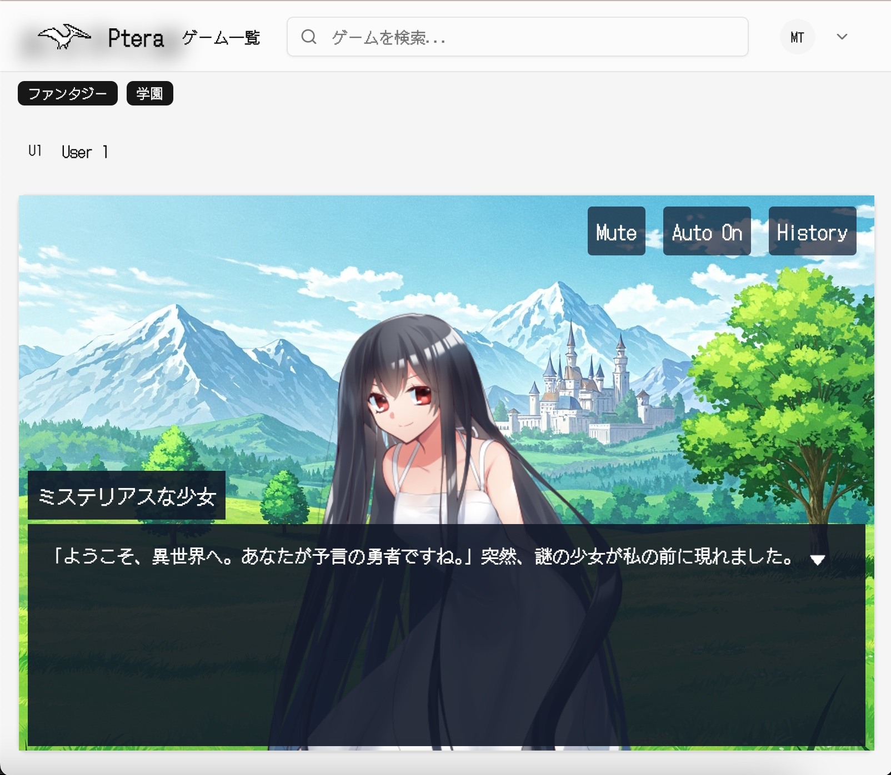
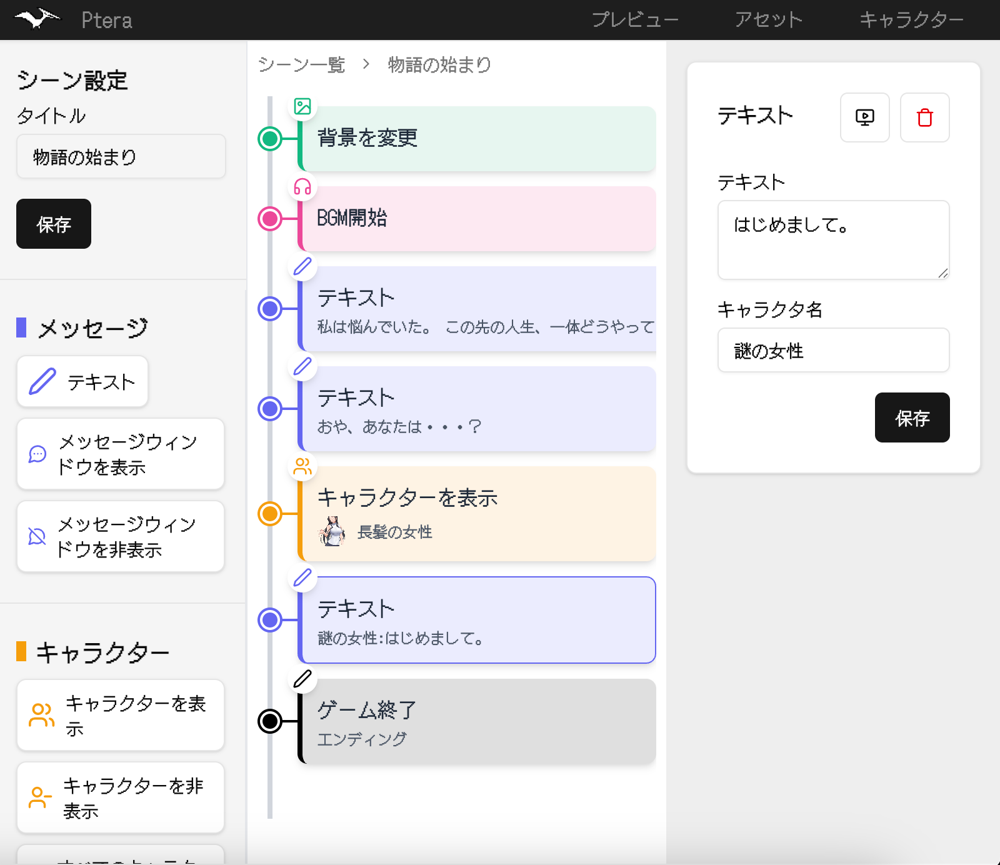

<div align="center">
  <div>
    
    <h1>Ptera</h1>
  </div>
  <p>Pteraは、ノベルゲームをブラウザで作成、公開できるサービスです。（現在開発中）<br/>
  <a href="https://ptera.morio.space">https://ptera.morio.space</a></p>
</p>
</div>





## プロジェクト構成

```
ptera/
├── packages # クライアント/サーバで共用するコード類
│   ├── schema # スキーマ定義
│   └── config # 定数
├── nextjs
│   └──src
│       ├── app # Next.jsアプリケーション
│       ├── client
│       └── server
├── terraform # インフラ構成
│   ├── env
│   │   ├── dev
│   │   └── prod
│   └── modules # モジュール
└── doc
```

### Prerequisite
- [Bun](https://bun.sh/)
- [Node.js](https://nodejs.org/)
- [direnv](https://direnv.net/)
- [Terraform](https://www.terraform.io/)
- [Terragrunt](https://terragrunt.gruntwork.io/)
- [Vercel CLI](https://vercel.com/docs/cli)

依存関係のバージョンは `.tool-versions` ([asdf](https://asdf-vm.com/) を使用) に記載。

## 開発環境の構築
1. Vercel プロジェクトにリンクして`.env.local`を取得。
   ```bash
   bunx vercel link
   bunx vercel env pull
   ```
2. 環境変数の設定
   ```bash
    direnv allow
    ```
3. 開発サーバーの起動
   ```bash
   bun run dev
   ```

# TODO

- [ ] カバー画像アップロード機能
- [ ] アバター変更機能
- [ ] キャラクター作成機能
- [ ] アセット機能
   - [ ] アセットアップロード機能
   - [ ] アセット削除機能
   - [ ] ユーザごとのアセットサイズ制限
- [ ] DB コスト下げる
   - [ ] VPS に全部移行できないか検討
   - [ ] 重めのクエリのキャッシュ
- [ ] フルスクリーンプレビュー機能
- [ ] プレビュー用URL発行機能
- [ ] サロゲートキー露出するのやめたい
- [ ] 結合テスト増やす

# 素材

- https://ranuking.ko-me.com/
- https://musmus.main.jp
- https://soundeffect-lab.info/
