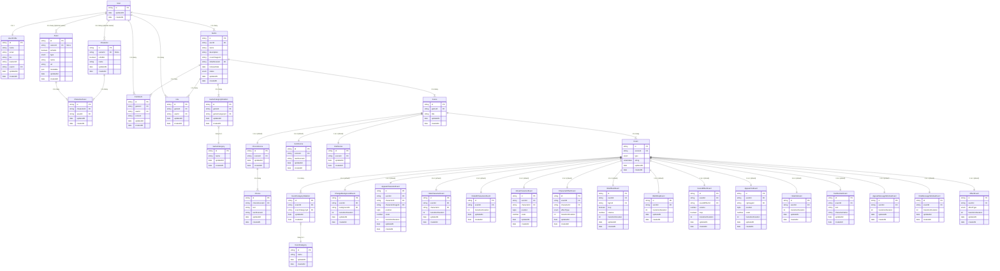

```mermaid
erDiagram
    User {
        string id PK
        date updatedAt
        date createdAt
    }

    UserProfile {
        string id PK
        string name
        string email
        string bio
        string avatarUrl
        string userId FK
        date updatedAt
        date createdAt
        %% User の id 参照
    }

    User ||--|| UserProfile : "1 to 1"

    Asset {
        string id PK
        string ownerId FK "NULL"
        %% nullの場合はパブリック
        boolean isPublic
        enum type
        %% (bgm | soundEffect | characterImage | backgroundImage | cg)
        string name
        string url
        json metadata
        %% mimetype, サイズなど
        date updatedAt
        date createdAt
    }

    %% リレーション (User 0..1 - 0..* Asset)
    %% ownerId が NULLならパブリック, そうでなければ User.id
    User ||--o{ Asset : "1 to many (optional owner)"

    Character {
        string id PK
        string ownerId FK "NULL"
        %% null の場合はパブリック
        boolean isPublic
        string name
        date updatedAt
        date createdAt
    }

    %% リレーション (User 0..1 - 0..* Character)
    User ||--o{ Character : "1 to many (optional owner)"

    CharacterAsset {
        string id PK
        string characterId FK
        string assetId FK
        date updatedAt
        date createdAt
    }

    Character ||--|{ CharacterAsset : "1 to many"
    Asset ||--|{ CharacterAsset : "1 to many"

    Game {
        string id PK
        string userId FK
        %% 作成者 User.id
        string name
        string description
        string coverImageUrl
        string initialSceneId FK
        date releaseDate
        enum status
        %% draft, published, archived
        date updatedAt
        date createdAt
    }

    %% リレーション (Game 0..* - 1 User)
    User ||--|{ Game : "1 to many"


    Comment {
        string id PK
        string gameId FK
        string userId FK
        string content
        date updatedAt
        date createdAt
    }

    Game ||--|{ Comment : "1 to many"
    User ||--|{ Comment : "1 to many"


    Like {
        string id PK
        string gameId FK
        string userId FK
        date updatedAt
        date createdAt
    }

    Game ||--|{ Like : "1 to many"
    User ||--|{ Like : "1 to many"


    GameCategory {
        string id PK
        string name
        date updatedAt
        date createdAt
    }

    GameCategoryRelation {
        string id PK
        string gameId FK
        string gameCategoryId FK
        date updatedAt
        date createdAt
    }

    Game ||--|{ GameCategoryRelation : "1 to many"
    GameCategoryRelation }|--|| GameCategory : "many to 1"


    Scene {
        string id PK
        string gameId FK
        string title
        date updatedAt
        date createdAt
    }

    %% Game 1 - n Scene
    Game ||--|{ Scene : "1 to many"

    %% ChoiceScene, GotoScene, EndScene は Scene の
    %% クラステーブル継承を想定。
    %% シンプルに sceneId をPK兼FKにして1:1にする形
    ChoiceScene {
        string id PK
        %% = Scene.id
        string sceneId FK
        %% ex. ChoiceScene特有のカラム
        date updatedAt
        date createdAt
    }

    Scene ||--|| ChoiceScene : "1 to 1 (inherit)"

    GotoScene {
        string id PK
        string sceneId FK
        string nextSceneId
        date updatedAt
        date createdAt
    }

    Scene ||--|| GotoScene : "1 to 1 (inherit)"

    EndScene {
        string id PK
        %% = Scene.id
        string sceneId FK
        %% EndScene固有のカラムがあれば
        date updatedAt
        date createdAt
    }

    Scene ||--|| EndScene : "1 to 1 (inherit)"


    Choice {
        string id PK
        string choiceSceneId FK
        string text
        string nextSceneId
        date updatedAt
        date createdAt
    }

    ChoiceScene ||--|{ Choice : "1 to many"


    Event {
        string id PK
        string sceneId FK
        enum type
        %% (ChangeBackground, AppearCharacter, etc.)
		orderIndex string
		%% Fractional Indexing
        date updatedAt
        date createdAt
        %% イベント共通のカラム
    }

    Scene ||--|{ Event : "1 to many"

    %% イベントカテゴリ (EventCategory) と イベントは多対多
    EventCategory {
        string id PK
        string name
        date updatedAt
        date createdAt
    }

    EventCategoryRelation {
        string id PK
        string eventId FK
        string eventCategoryId FK
        date updatedAt
        date createdAt
    }

    Event ||--|{ EventCategoryRelation : "1 to many"
    EventCategoryRelation }|--|| EventCategory : "many to 1"

    %% 以下、派生イベント用テーブル(クラステーブル継承)
    ChangeBackgroundEvent {
        string id PK
        string eventId FK
        string backgroundId FK
        int transitionDuration
        date updatedAt
        date createdAt
    }
    Event ||--|| ChangeBackgroundEvent : "1 to 1 (inherit)"

    AppearCharacterEvent {
        string id PK
        string eventId FK
        string characterId FK
        string characterImageId FK
        tuple position
        number scale
        int transitionDuration
        date updatedAt
        date createdAt
    }
    Event ||--|| AppearCharacterEvent : "1 to 1 (inherit)"

    HideCharacterEvent {
        string id PK
        string eventId FK
        string characterId FK
        int transitionDuration
        date updatedAt
        date createdAt
    }
    Event ||--|| HideCharacterEvent : "1 to 1 (inherit)"

    HideAllCharactersEvent {
        string id PK
        string eventId FK
        int transitionDuration
        date updatedAt
        date createdAt
    }
    Event ||--|| HideAllCharactersEvent : "1 to 1 (inherit)"

    MoveCharacterEvent {
        string id PK
        string eventId FK
        string characterId FK
        tuple position
        number scale
        date updatedAt
        date createdAt
    }
    Event ||--|| MoveCharacterEvent : "1 to 1 (inherit)"

    CharacterEffectEvent {
        string id PK
        string eventId FK
        string characterId FK
        enum effectType
        int transitionDuration
        date updatedAt
        date createdAt
    }
    Event ||--|| CharacterEffectEvent : "1 to 1 (inherit)"

    BGMStartEvent {
        string id PK
        string eventId FK
        string bgmId FK
        boolean loop
        number volume
        int transitionDuration
        date updatedAt
        date createdAt
    }
    Event ||--|| BGMStartEvent : "1 to 1 (inherit)"

    BGMStopEvent {
        string id PK
        string eventId FK
        int transitionDuration
        date updatedAt
        date createdAt
    }
    Event ||--|| BGMStopEvent : "1 to 1 (inherit)"

    SoundEffectEvent {
        string id PK
        string eventId FK
        string soundEffectId FK
        number volume
        boolean loop
        int transitionDuration
        date updatedAt
        date createdAt
    }
    Event ||--|| SoundEffectEvent : "1 to 1 (inherit)"

    AppearCGEvent {
        string id PK
        string eventId FK
        string cgImageId FK
        tuple position
        number scale
        int transitionDuration
        date updatedAt
        date createdAt
    }
    Event ||--|| AppearCGEvent : "1 to 1 (inherit)"

    HideCGEvent {
        string id PK
        string eventId FK
        int transitionDuration
        date updatedAt
        date createdAt
    }
    Event ||--|| HideCGEvent : "1 to 1 (inherit)"

    TextRenderEvent {
        string id PK
        string eventId FK
        string text
        string characterName
        date updatedAt
        date createdAt
    }
    Event ||--|| TextRenderEvent : "1 to 1 (inherit)"

    AppearMessageWindowEvent {
        string id PK
        string eventId FK
        int transitionDuration
        date updatedAt
        date createdAt
    }
    Event ||--|| AppearMessageWindowEvent : "1 to 1 (inherit)"

    HideMessageWindowEvent {
        string id PK
        string eventId FK
        int transitionDuration
        date updatedAt
        date createdAt
    }
    Event ||--|| HideMessageWindowEvent : "1 to 1 (inherit)"

    EffectEvent {
        string id PK
        string eventId FK
        enum effectType
        int transitionDuration
        date updatedAt
        date createdAt
    }
    Event ||--|| EffectEvent : "1 to 1 (inherit)"

```
