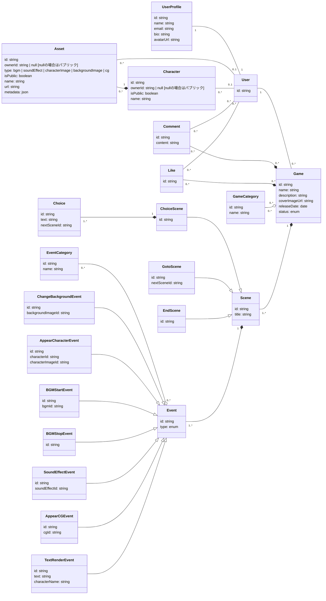

```mermaid
classDiagram
direction RL

class User {
  id: string
}

class UserProfile {
  id: string
  name: string
  email: string
  bio: string
  avatarUrl: string
}

User "1" -- "1" UserProfile

class Asset {
  id: string
  ownerId: string | null [nullの場合はパブリック]
  type: bgm | soundEffect | characterImage | backgroundImage | cg
　isPublic: boolean
  name: string
  url: string
  metadata: json
}

User "0..1" -- "0..*" Asset

class Character {
  id: string
  ownerId: string | null [nullの場合はパブリック]
  isPublic: boolean
  name: string
}

Character "1"*--"0..*" Asset
User "0..1" --"0..*" Character

class Game {
  id: string
  name: string
  description: string
  coverImageUrl: string
  releaseDate: date
  status: enum
}

Game "0..*"--"1" User

class Comment {
  id: string
  content: string
}

Game "0..*"*--"0..*" Comment
User "0..*"--"0..*" Comment

class Like {
  id: string
}

Game "0..*"*--"0..*" Like
User "0..*"--"0..*" Like

class GameCategory {
  id: string
  name: string
}

Game "0..*"o--"0..*" GameCategory

class Scene {
  id: string
  title: string
}

class ChoiceScene {
  id: string
}

class GotoScene {
  id: string
  nextSceneId: string
}

class EndScene {
  id: string
}

Scene <|-- ChoiceScene
Scene <|-- GotoScene
Scene <|-- EndScene

class Choice {
  id: string
  text: string
  nextSceneId: string
}

ChoiceScene "1"*--"1..*" Choice

Game "1"*--"1..*" Scene

class Event {
  id: string
  type: enum
}

class EventCategory {
  id: string
  name: string
}

Event "0..*"o--"0..*" EventCategory

class ChangeBackgroundEvent {
  id: string
  backgroundImageId: string
}

class AppearCharacterEvent {
  id: string
  characterId: string
  characterImageId: string
}

class BGMStartEvent {
  id: string
  bgmId: string
}

class BGMStopEvent {
  id: string
}

class SoundEffectEvent {
  id: string
  soundEffectId: string
}

class AppearCGEvent {
  id: string
  cgId: string
}

class TextRenderEvent {
  id: string
  text: string
  characterName: string
}

Event <|-- ChangeBackgroundEvent
Event <|-- AppearCharacterEvent
Event <|-- BGMStartEvent
Event <|-- BGMStopEvent
Event <|-- SoundEffectEvent
Event <|-- AppearCGEvent
Event <|-- TextRenderEvent

Scene "1"*--"1..*" Event
```
